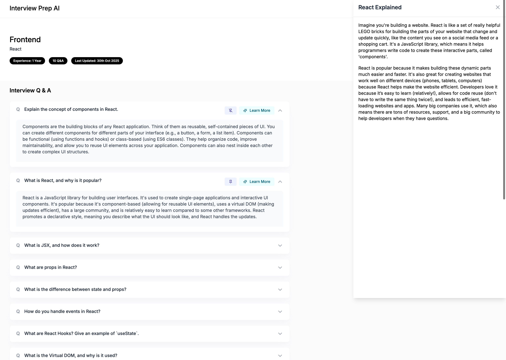

# Interview Prep AI App

An AI-powered web application that helps you **prepare for technical interviews**.  
It generates role-specific questions, detailed answers, and concept explanations using **Google Gemini AI**.

---

## Features
- User Authentication (Register / Login with JWT)
- AI-generated Interview Questions (Gemini)
- Organize and Save Multiple Interview Sessions
- Pin or Add Notes to Important Questions
- Upload Profile Picture
- Built with **MERN Stack** (MongoDB, Express, React, Node.js)

---

## Screenshots

### Landing Page


### Dashboard


---

## 🔗 Live Demo
[Visit Live App]([https://your-deployment-link.com](https://interview-prep-app.netlify.app/))

---

## ⚙️ Tech Stack

**Frontend:**
- React (Vite)
- Tailwind CSS
- React Router
- Axios

**Backend:**
- Node.js
- Express.js
- MongoDB (Mongoose)
- Multer (for image upload)
- JSON Web Token (JWT)
- @google/genai (Gemini API)

---

## 📂 Project Structure

```
interview-prep-ai/
│
├── 📁 backend/
│   ├── 📁 config/
│   │   └── db.js                # MongoDB connection setup
│   │
│   ├── 📁 controllers/           # Handles business logic
│   │   ├── authController.js    # Register, Login, Profile
│   │   ├── aiController.js      # Gemini AI (generate questions, explanations)
│   │   ├── sessionController.js # Create, get, delete interview sessions
│   │   └── questionController.js# Add, pin, note questions
│   │
│   ├── 📁 middlewares/
│   │   ├── authMiddleware.js    # JWT token verification
│   │   └── uploadMiddleware.js  # Multer config for image uploads
│   │
│   ├── 📁 models/
│   │   ├── User.js              # User schema
│   │   ├── Session.js           # Interview session schema
│   │   └── Question.js          # Question schema (linked to session)
│   │
│   ├── 📁 routes/
│   │   ├── authRoutes.js        # /api/auth → register, login, upload-image
│   │   ├── sessionRoutes.js     # /api/sessions → create, list, delete sessions
│   │   └── questionRoutes.js    # /api/questions → add, pin, note
│   │
│   ├── 📁 utils/
│   │   └── prompts.js           # Gemini AI prompt templates
│   │
│   ├── 📁 uploads/               # Uploaded images are stored here
│   │
│   ├── .env                     # Environment variables (MongoDB, JWT, Gemini)
│   ├── package.json             # Backend dependencies & scripts
│   └── server.js                # Express app entry point
│
│
├── 📁 frontend/
│   ├── 📁 public/                # Static assets (favicons, index.html, etc.)
│   │
│   ├── 📁 src/
│   │   ├── 📁 assets/            # Images & icons (e.g., ChatGPT image)
│   │   ├── 📁 components/
│   │   │   ├── Modal.jsx        # Auth modal component
│   │   │   ├── Cards/           # UI cards (ProfileInfoCard, QuestionCard, etc.)
│   │   │   └── common/          # Buttons, loaders, etc.
│   │   │
│   │   ├── 📁 context/
│   │   │   └── userContext.jsx  # Global user authentication context
│   │   │
│   │   ├── 📁 pages/
│   │   │   ├── LandingPage.jsx  # Home page
│   │   │   ├── Dashboard.jsx    # User dashboard (sessions list)
│   │   │   ├── InterviewPrep.jsx# Create session, generate AI questions
│   │   │   └── Auth/            # Login and SignUp pages
│   │   │
│   │   ├── 📁 utils/
│   │   │   ├── api.js           # Axios instance (backend requests)
│   │   │   └── data.js          # Static content (features, etc.)
│   │   │
│   │   ├── App.jsx              # Root component, handles routes
│   │   ├── main.jsx             # React entry point (Vite)
│   │   └── index.css            # Global styles (TailwindCSS)
│   │
│   ├── package.json             # Frontend dependencies
│   └── vite.config.js           # Vite configuration
│
│
├── 📁 screenshots/               # Project images for README
│   ├── landing.png
│   └── dashboard.png
│
├── README.md                     # Project documentation
└── .gitignore                    # Ignore node_modules, .env, uploads, etc.

```

---

## Setup Instructions

### 1 Clone Repository
```bash
git clone https://github.com/yourusername/interview-prep-ai.git
cd interview-prep-ai
```

### 2 Install Backend
```bash
cd backend
npm install
```

### 3 Create `.env` File
```bash
PORT=5000
MONGO_URI=your_mongodb_connection_string
JWT_SECRET=your_secret_key
GEMINI_API_KEY=your_gemini_api_key
```

### 4 Start Backend
```bash
npm run dev
```

Server will run on:  
👉 `http://localhost:5000`

### 5 Install Frontend
```bash
cd ../frontend
npm install
npm run dev
```

Frontend will run on:  
👉 `http://localhost:5173`

---

## API Endpoints (Quick Overview)

| Method | Endpoint | Description |
|--------|-----------|-------------|
| POST | `/api/auth/register` | Register new user |
| POST | `/api/auth/login` | Login user |
| GET | `/api/auth/profile` | Get user profile |
| POST | `/api/ai/generate-questions` | Generate AI interview questions |
| POST | `/api/ai/generate-explanation` | Generate concept explanation |
| POST | `/api/auth/upload-image` | Upload profile image |

---

## Example: Generate Questions (Gemini)
```json
POST /api/ai/generate-questions
{
  "role": "Frontend Developer",
  "experience": "2",
  "topicsToFocus": "React, CSS, JavaScript",
  "numberOfQuestions": 5
}
```

Response:
```json
[
  {
    "question": "What is JSX in React?",
    "answer": "JSX is a syntax extension for JavaScript used in React..."
  }
]
```

---

## Author
**Recep Demir**  
demir.rp@gmail.com  

---

## Credits
- Google Gemini AI  
- Clarusway Full Stack Development Program  

---

### “Prepare Smart. Practice with AI.”
